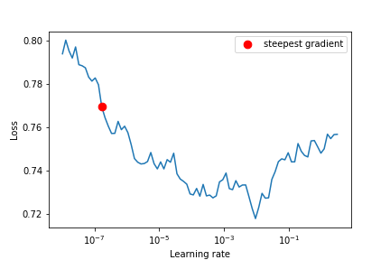

<h1 align=center>Cat vs Dog Binary Classification on reduced dataset interview submission</h1> 

# Baseline
### Random classifier
This classifier defines the minimum possible performances on this task.
> **Note** 
> Test accuracy: 0.50 (balanced dataset)

### Resnet50 without any experiments

In this short time exercise, the idea was to evaluate a model and iterate on different parameters to get the best possible performances. Here I choose to use a resnet50 because it well performs on different computer vision tasks including image classification: a lot of variants are in the [paper with code CIFAR-100 benmark](https://paperswithcode.com/sota/image-classification-on-cifar-100). 

The choice of this feature extractor will be explained below, but one reason to use it here was that I had already implemented it several times in the past, so to be more focused on the hyperparameters choices.

Another way to be quick would be to use a ready-to-use DL model, but the idea was also to show the programming capabilities.

> **Note** 
> Test accuracy: 0.81

This first experiment shows that the learning capabilities of are sufficient with a Resnet50 with an accuracy > 0.97 (and because of the small trainset of 2k images). The final result will depend on the ability to avoid overfitting.

# Improve performances vs avoid overfitting

## Choice of feature extractor

### Resnet
As we explain in the introduction the choice of the feature extractor was based on :
- easy to implement 
- easily scalable on different size
- well perform on cv tasks

In the introduction, we see that with a Resnet50 we overfit too much so the choice was to reduce the model size to a Resnet18 to speed up training.

> **Note** 
> An important fact is that during these experiments, I use google colab (free plan) to train the model and so it gives access to limited resources.

## Training parameters

### Learning rate and optimizer

#### Learning rate
- select the most interesting LR : 
    - According to [sgugger blog](https://sgugger.github.io/how-do-you-find-a-good-learning-rate.html#how-do-you-find-a-good-learning-rate) we can use a [fast.ai]()'s framework to compute an approximation of the best choice for learning rate. It depends on the model and the dataset. This curve is not always stable so we need to use it carefully. The idea is to take the LR where the $\frac{dLoss}{dLr}$ is negative with the steepest slope for a faster hypothetical convergence.

> **Note** 
> Suggested lr: 1.67e-07

#### Optimizer
- Adam
> create a variable learning rate for all layers between 0 and the defined learning rate.

As we already have several hyperparameters, Adam was chosen because it also well perform on many DL tasks.

#### Scheduler
- Many different schedulers are available on PyTorch, the more commonly used are:
    - Reduce lr on step
    - Reduce lr on plateau
    - Cyclic

We could try many of them but reduce lr on plateau was used for his automatic aspect and to fit more with the loss function. It could be also interesting to use cyclic LR to avoid local minimum.

## Improve performances

## Data normalization

In [this medium article](https://towardsdatascience.com/batch-norm-explained-visually-how-it-works-and-why-neural-networks-need-it-b18919692739), the author very well explains how it is important to normalize input data for faster and accurate convergence. In the same way, he explains that batch norms speed up convergence. 

### Transfer learning
> **Warning** 
> Pre-train on imagenet was not considered because imagenet contains images of cats and dogs.

## Image size

The idea was to make a compromise between calculation time and accuracy. A standard value for this image and for this task is 224x224. As we hard resize images without padding, the model will need to be robust to some deformations.

## Batch size

* small batch size:
    > do not use the interest of matrix optimization
* big batch size:
    > convergence time
    > computer storage limitation

Based on Yoshua Bnegio [paper](https://arxiv.org/pdf/1206.5533.pdf), a good starting point could be 32. Trying different configurations (16, 32, 64), No big improvements were measured.

## Avoid overfitting

## Augmentations

- selecting relevant augmentation with data (photos in a casual context)
    - need to be invariant to 3D rotation, scale, zoom, crop, color, brightness
    - can be many instances on the pictures (many times the same class, human, ...)

So also many augmentations are available in torchvision and the idea was to create more uncertainty on the input images (degradations, noise, ...) to avoid overfitting (and so improving the robustness).

As we can see in the sample above we combine many augmentations to create more variability in the training set (and artificially create new training examples).

The last thing that could be added is CutMix which randomly adds patches on images to improve variability. This was not added in the first time because it can be too hard for the model in the first epochs.

So with these different improvements, the accuracy on the test achieves 0.94 (+13pt)! This is very encouraging but as we can see we still overfit training data so it is needed to increase regularization. 

> **Note** 
> Test accuracy: 0.94

## Weight decay

This consist to keep small values to avoid overfitting. It uses coeff $\alpha$ (another hyperparameter) as a regularization parameter. As we can see in the graph below, with the same configurations as above, we reduce overfitting (same performances in train and in validation) but we can not archive the same level of performance. $\alpha$ = 1e-4 and 1e-5 have been tried with the same results.

An idea could be to continue to decrease the value or increase the model size to a Resnet34 or Resnet50 to find the best compromise and maybe increase test accuracy.

> **Note** 
> Test accuracy: 0.86

# Other possible improvements (not done during the test)

### Self-supervised learning

- pretrain model using a pretext task: the more relevant task should be predicting the relative position of image patches ([ref.](https://atcold.github.io/pytorch-Deep-Learning/en/week10/10-1/))
    - easy to implement and easy to understand

### Try with Transformer feature extractor like swin

A lot of more modern architectures using visual transformers archive [SOTA performances](https://paperswithcode.com/paper/an-image-is-worth-16x16-words-transformers-1) on CIFAR-10.

An implementation of VIT was tried during this exercise but the model was stuck around 0.6-0.7 so focus on the simplest architecture to match with time constraints.

### More augmentations

We use augmentation to train the model but it can also be used for prediction with many TTA and concatenate outputs.

### Ensembling

Another way to build a more robust model on prediction could be to ensemble distinct models we different training conditions and also concatenate the outputs.

### An analytical study

By taking the time to visually analyze the errors made by the model, we can identify the points to be improved to eventually propose a more adapted solution (specific augmentation, etc.).
